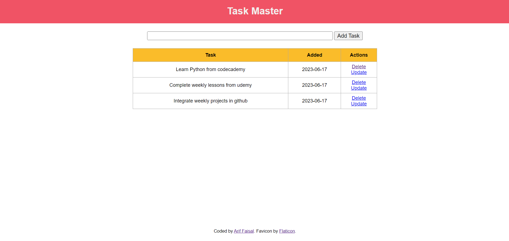

# Taskmaster 

With TaskMaster, you can create, track, and prioritize your daily, weekly, or monthly tasks effortlessly. Users will be able to create, read, update, or delete (CRUD) any tasks.

## Table of contents

- [Overview](#overview)
  - [Usage](#usage)
  - [Screenshot](#screenshot)
  - [Links](#links)
- [My process](#my-process)
  - [Built with](#built-with)
- [Author](#author)
- [Disclaimer](#disclaimer)

## Overview

### Usage

Users should be able to:

- Create a new task
- Read any tasks
- Update any existing tasks
- Delete any existing tasks

### Screenshot

### Links

- Github URL: [https://github.com/arifaisal123/backend_projects/tree/main/taskmaster](https://github.com/arifaisal123/backend_projects/tree/main/taskmaster)
- Live Site URL: [https://daily-task-manager.onrender.com](https://daily-task-manager.onrender.com)

## My process

### Built with

- Semantic HTML5 markup
- CSS custom properties
- Flexbox
- Backend: Flask 

## Author

- Website - [Arif Faisal](https://arifaisal123.github.io)
- Twitter - [@faisalcodes123](https://www.twitter.com/faisalcodes123)

## Disclaimer
This is a test project, and it currently does not have session management, or any user auth system. Therefore, tasks provided by other users are visible.
